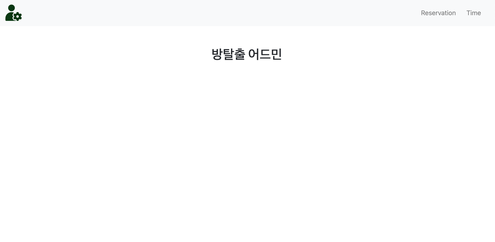
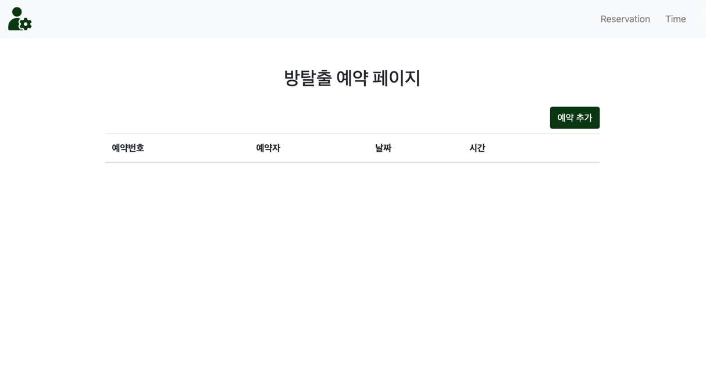
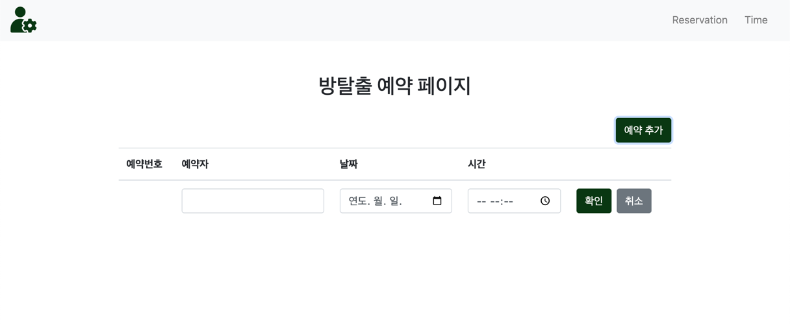
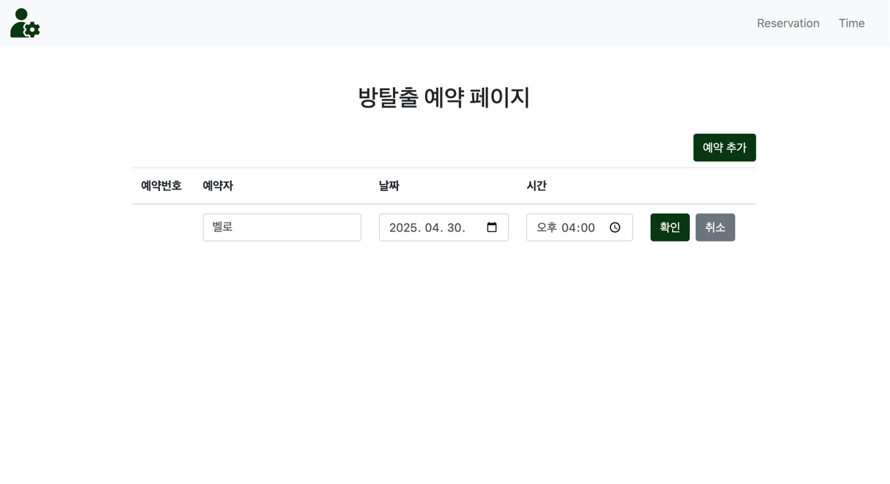
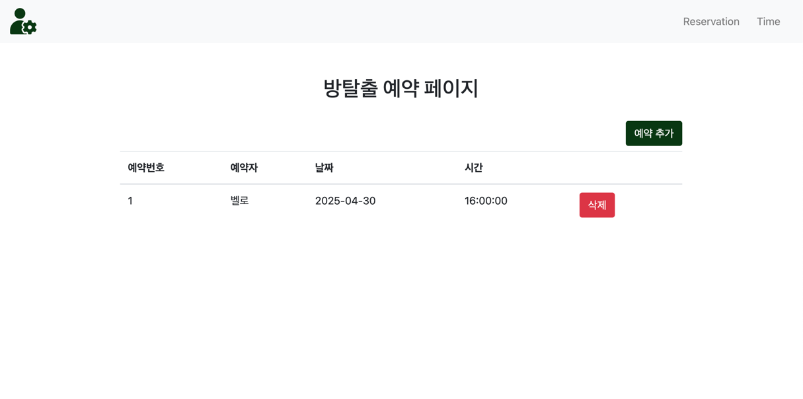

# 방탈출 예약 관리 애플리케이션

방탈출 예약을 관리할 수 있는 웹 애플리케이션을 구현합니다.

## 구현할 기능 목록

- [X] 관리자 홈 화면
    - [X] `GET - /admin` 요청 시 관리자 홈 화면을 응답한다.
- [X] 예약 조회
    - [X] `GET - /admin/reservation` 요청 시 예약 관리 화면을 응답한다.
        - [X] 예약 목록 조회 API를 구현한다.
            - [X] `GET - /reservations` 요청 시 예약 목록을 반환한다.
- [X] 예약 추가
    - [X] 예약 추가 API를 구현한다.
        - [X] `POST - /reservations` 요청 시 예약을 추가한다.
        - [X] 과거 일시로 예약할 수 없다. 
- [X] 예약 취소
    - [X] 예약 삭제 API를 구현한다.
        - [X] `DELETE - /reservations/{id}` 요청 시 예약을 취소한다.

## 사용 예시

애플리케이션 실행 후 [localhost:8080/admin](http://localhost:8080/admin) 으로 접속할 수 있습니다.

### 관리자 홈 화면

우측 상단 `Reservation`을 누르면 예약 관리 화면으로 이동합니다.
`Time`은 현재 미구현 상태입니다.

### 예약 관리 화면

`예약 추가` 버튼으로 예약을 추가할 수 있습니다.
추가 이후 `삭제` 버튼으로 예약을 취소할 수 있습니다.