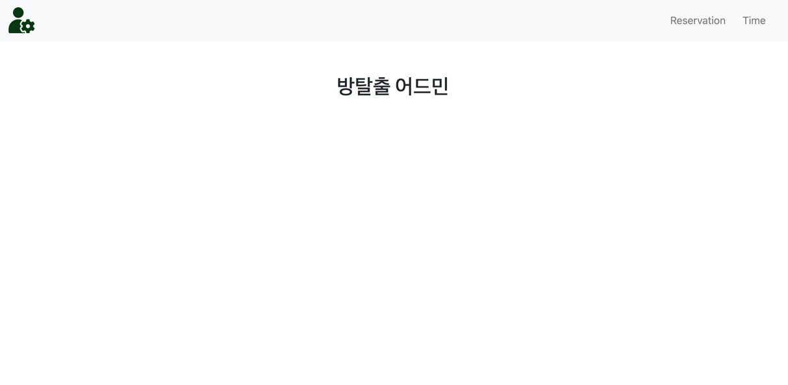
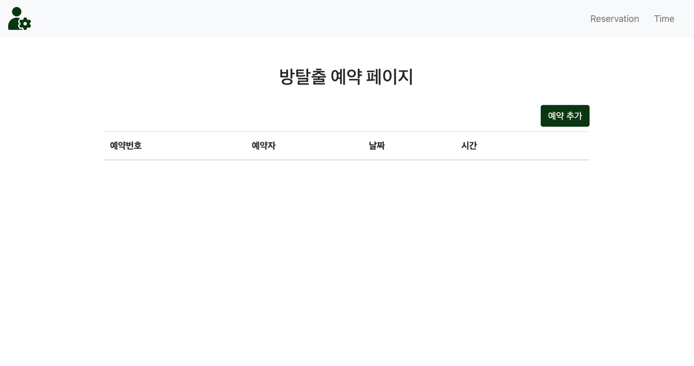
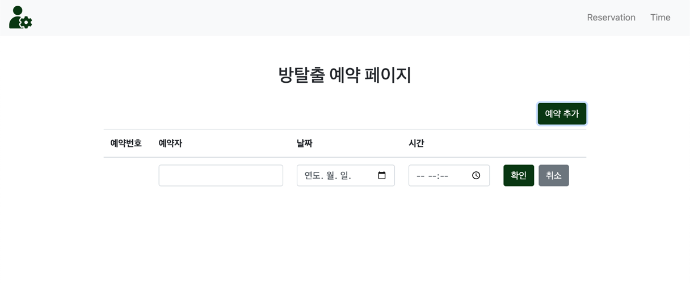
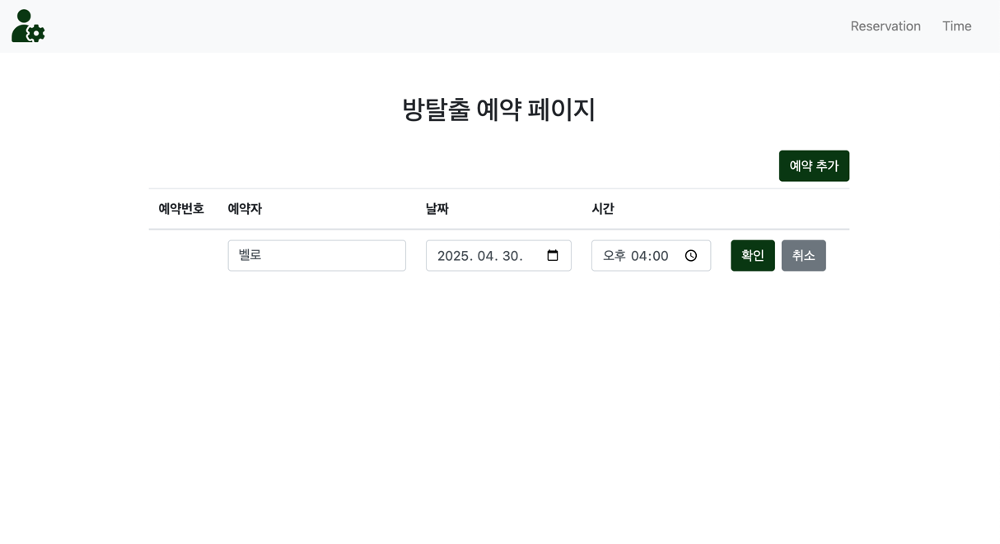
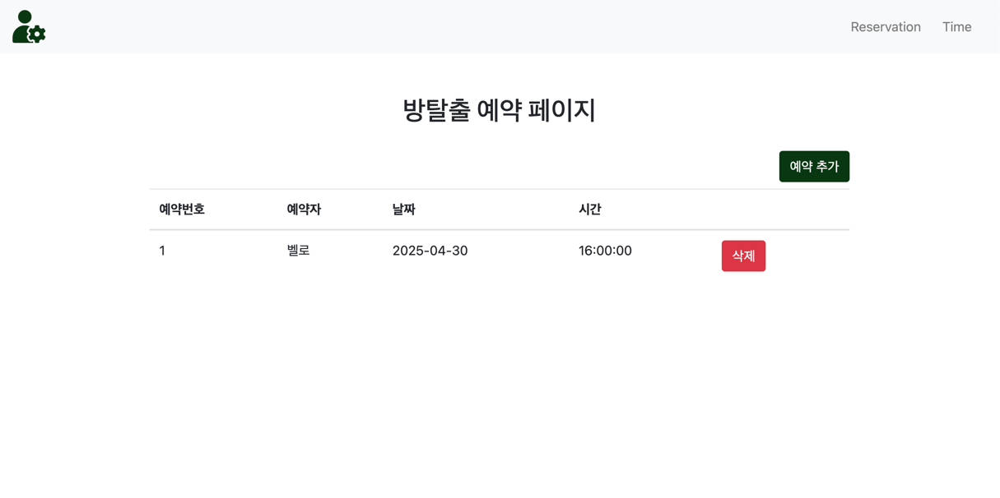
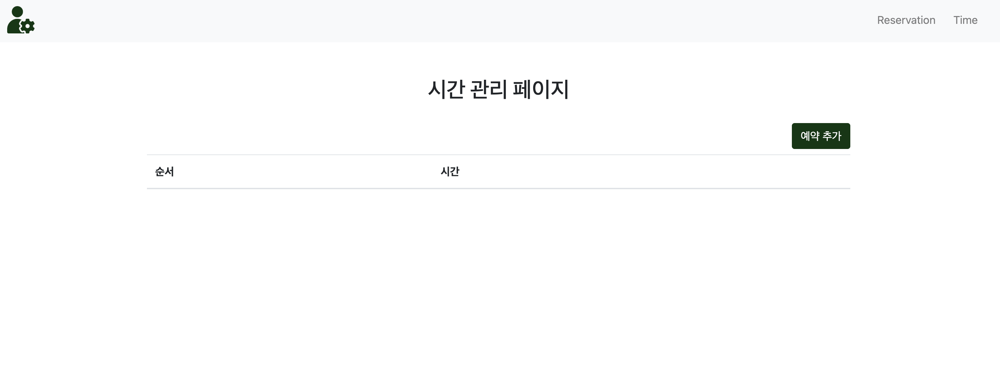
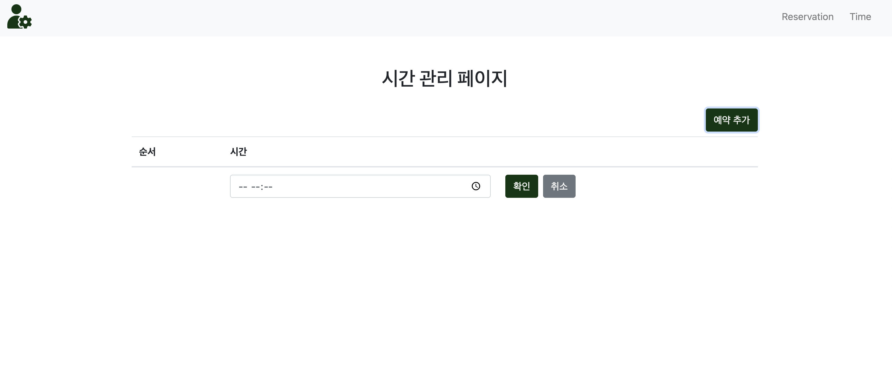
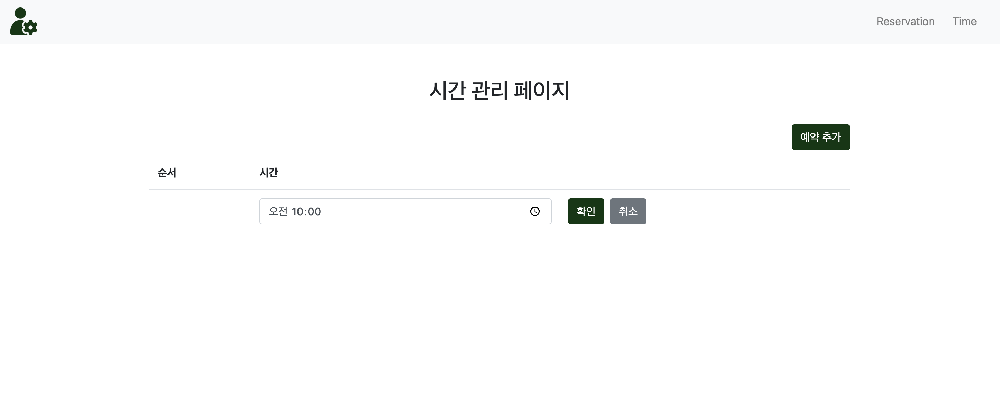
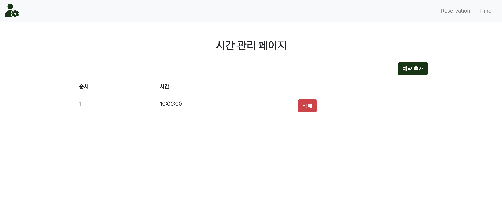

# 방탈출 예약 관리 애플리케이션

방탈출 예약을 관리할 수 있는 웹 애플리케이션을 구현합니다.

## 구현할 기능 목록

- [X] 관리자 홈 화면
    - [X] `GET - /admin` 요청 시 관리자 홈 화면을 응답한다.
- [X] 예약 조회
    - [X] `GET - /admin/reservation` 요청 시 예약 관리 화면을 응답한다.
        - [X] 예약 목록 조회 API를 구현한다.
            - [X] `GET - /reservations` 요청 시 예약 목록을 반환한다.
- [X] 예약 추가
    - [X] 예약 추가 API를 구현한다.
        - [X] `POST - /reservations` 요청 시 예약을 추가한다.
        - [X] 과거 일시로 예약할 수 없다.
        - [X] 지정된 시간 중 원하는 시간을 선택할 수 있다.
- [X] 예약 취소
    - [X] 예약 삭제 API를 구현한다.
        - [X] `DELETE - /reservations/{id}` 요청 시 예약을 취소한다.
- [X] 예약 시간 조회
    - [X] `GET - /admin/time` 요청 시 시간 관리 화면을 응답한다.
        - [X] 시간 목록 조회 API를 구현한다.
            - [X] `GET - /times` 요청 시 시간 목록을 반환한다.
- [X] 예약 시간 추가
    - [X] 시간 추가 API를 구현한다.
        - [X] `POST - /times` 요청 시 시간을 추가한다.
- [X] 예약 시간 삭제
    - [X] 시간 삭제 API를 구현한다.
        - [X] `DELETE - /times/{id}` 요청 시 시간을 삭제한다.

## 사용 예시

애플리케이션 실행 후 [localhost:8080/admin](http://localhost:8080/admin) 으로 접속할 수 있습니다.

### 관리자 홈 화면



우측 상단 `Reservation`을 누르면 예약 관리 화면으로 이동합니다.
`Time`을 누르면 시간 관리 화면으로 이동합니다.

### 예약 관리 화면









`예약 추가` 버튼으로 예약을 추가할 수 있습니다.
추가 이후 `삭제` 버튼으로 예약을 취소할 수 있습니다.

### 예약 시간 관리 화면









`예약 추가` 버튼으로 예약 시간을 추가할 수 있습니다.
추가 이후 `삭제` 버튼으로 예약 시간을 제거할 수 있습니다.

## 📘 API 명세

## 1. 예약 시간 API

### ✅ 1.1 예약 시간 전체 조회
- 등록된 모든 예약 시간을 조회합니다.
- **HTTP Method**: `GET`
- **URL**: `/times`

#### 📥 Request
- 없음

#### 📤 Response
- **content-type**: application/json
```json
[
  {
    "id": 1,
    "startAt": "10:00"
  },
  {
    "id": 2,
    "startAt": "11:00"
  }
]
```

#### 📌 상태코드
| 코드 | 설명 |
|:----:|:-----|
| 200 OK | 조회 성공 |

---

### ✅ 1.2 예약 시간 추가
- 새로운 예약 시간을 등록합니다.
- **HTTP Method**: `POST`
- **URL**: `/times`

#### 📥 Request
- **content-type**: application/json
```json
{
  "startAt": "15:00"
}
```

#### 📤 Response
- **content-type**: application/json
```json
{
  "id": 3,
  "startAt": "15:00"
}
```

#### 📌 상태코드
| 코드 | 설명 |
|:----:|:-----|
| 200 OK | 등록 성공 |
| 400 Bad Request | 유효하지 않은 입력 값 |

---

### ✅ 1.3 예약 시간 삭제
- 예약 시간을 삭제합니다.
- **HTTP Method**: `DELETE`
- **URL**: `/times/{id}`

#### 📥 Request
- `id` (Long): 삭제할 예약 시간 ID

#### 📤 Response
- 없음

#### 📌 상태코드
|      코드       | 설명 |
|:-------------:|:-----|
|    200 OK     | 삭제 성공 |

---

## 2. 예약 API

### ✅ 2.1 예약 전체 조회
- 등록된 모든 예약을 조회합니다.
- **HTTP Method**: `GET`
- **URL**: `/reservations`

#### 📥 Request
- 없음

#### 📤 Response
- **content-type**: application/json
```json
[
  {
    "id": 1,
    "name": "홍길동",
    "date": "2025-05-01",
    "time": {
      "id": 2,
      "startAt": "11:00"
    }
  }
]
```

#### 📌 상태코드
| 코드 | 설명 |
|:----:|:-----|
| 200 OK | 조회 성공 |

---

### ✅ 2.2 예약 추가
- 새로운 예약을 등록합니다.
- **HTTP Method**: `POST`
- **URL**: `/reservations`

#### 📥 Request
- **content-type**: application/json
```json
{
  "name": "홍길동",
  "date": "2025-05-01",
  "timeId": 2
}
```

#### 📤 Response
- **content-type**: application/json
```json
{
  "id": 1,
  "name": "홍길동",
  "date": "2025-05-01",
  "time": {
    "id": 2,
    "startAt": "11:00"
  }
}
```

#### 📌 상태코드
| 코드 | 설명 |
|:----:|:-----|
| 200 OK | 등록 성공 |
| 400 Bad Request | 유효하지 않은 입력 값 |

---

### ✅ 2.3 예약 삭제
- 예약을 취소합니다.
- **HTTP Method**: `DELETE`
- **URL**: `/reservations/{id}`

#### 📥 Request
- `id` (Long): 삭제할 예약 ID

#### 📤 Response
- 없음

#### 📌 상태코드
|   코드   | 설명 |
|:------:|:-----|
| 200 Ok | 삭제 성공 |

---

## 3. 관리자 페이지 (View)

> 이 API들은 JSON을 반환하지 않고, **화면(View)** 을 반환합니다.

### ✅ 3.1 관리자 홈 화면 이동
- 관리자 홈 화면(`admin/index`)로 이동합니다.
- **HTTP Method**: `GET`
- **URL**: `/admin`

---

### ✅ 3.2 예약 관리 화면 이동
- 예약 관리 화면(`admin/reservation`)으로 이동합니다.
- **HTTP Method**: `GET`
- **URL**: `/admin/reservation`

---

### ✅ 3.3 예약 시간 관리 화면 이동
- 예약 시간 관리 화면(`admin/time`)으로 이동합니다.
- **HTTP Method**: `GET`
- **URL**: `/admin/time`
