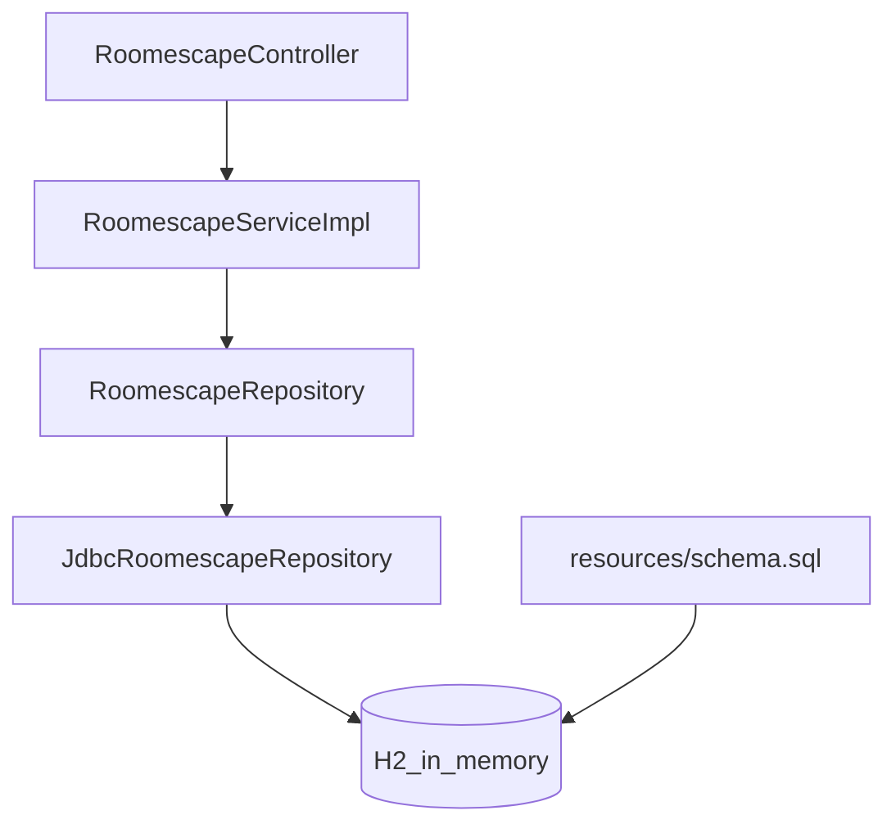

## 2단계(H2 + JdbcTemplate) 전환 작업 계획

### 목표/완료 조건
- `GET /reservations`, `POST /reservations`, `DELETE /reservations/{id}`가 메모리 저장이 아닌 H2 DB를 사용한다.
- `POST /reservations` 응답에 DB가 생성한 `id`가 포함된다(기존 `MissionStepTest`의 `body("id", is(1))` 기대 충족).
- `docs/study-log/level2.md`에 나온 3개 테스트(데이터베이스 연동 / DB 조회 API 전환 / DB 추가·삭제 API 전환)가 통과한다.

### 현 상태(확인된 코드)
- 메모리 저장 구현체: `src/main/java/roomescape/repository/ListMemoryRepository.java`가 `List<Reservation> + AtomicLong`으로 id 발급/저장.
- API 레이어: `src/main/java/roomescape/controller/RoomescapeController.java` -> `RoomescapeService` -> `RoomescapeRepository`.
- 기존 통합 테스트: `src/test/java/roomescape/MissionStepTest.java`는 응답 형태가 `{ reservations: [...] }`이고, 생성 시 `id == 1`을 기대.
- `src/main/resources/application.properties`는 비어있음.
- `build.gradle`에는 아직 JDBC/H2 의존성이 없음.

### 변경/추가할 파일들(핵심)
- `build.gradle`
- `src/main/resources/application.properties`
- (신규) `src/main/resources/schema.sql`
- (신규) `src/main/java/roomescape/repository/JdbcRoomescapeRepository.java` (또는 유사 이름)
- (삭제 또는 비활성화) `src/main/java/roomescape/repository/ListMemoryRepository.java`
- (신규) `src/test/java/roomescape/DatabaseMissionStepTest.java` (요구사항 3개 테스트 포함)

### 구현 접근(Repository 교체 중심)
- `spring-boot-starter-jdbc`를 추가하면 `JdbcTemplate`이 자동 Bean 등록된다.
- Repository 구현을 `JdbcTemplate` 기반으로 새로 만들고, 기존 `RoomescapeRepository` 인터페이스는 유지한다.
- `ListMemoryRepository`는 Spring Bean으로 등록되지 않도록 제거(파일 삭제)하거나 `@Repository`를 제거한다.
- 두 구현이 동시에 Bean으로 남으면 주입이 애매해질 수 있다.

### DB 스키마/설정
- `schema.sql`에 `reservation` 테이블 생성 DDL을 추가한다.
- `application.properties`에 H2 콘솔 및 datasource URL을 설정한다.

### id 발급(INSERT 후 생성 id 반환)
- `RoomescapeRepository.save()`는 저장 후 생성된 `id`가 포함된 `Reservation`을 반환해야 한다.
- 구현 선택지:
  - `KeyHolder`를 사용한 `jdbcTemplate.update(PreparedStatementCreator, keyHolder)`
  - `SimpleJdbcInsert`로 insert + generated key 반환
- 프로젝트 단순성을 위해 한 가지로 통일한다(보통 `SimpleJdbcInsert`가 코드가 짧음).

### 테스트 추가/조정
- 기존 `MissionStepTest`는 2단계 요구사항과 충돌이 없어 보이므로(응답 JSON wrapper / `id=1` 기대) 유지한다.
- `docs/study-log/level2.md`의 3개 테스트를 새 테스트 클래스로 추가한다.
- 테스트 설정:
  - `@SpringBootTest(webEnvironment = DEFINED_PORT)`
  - `@DirtiesContext(BEFORE_EACH_TEST_METHOD)`
  - `@Autowired JdbcTemplate jdbcTemplate`
- 검증 항목:
  - Connection / `getCatalog()` / `getTables()` 검증
  - DB에 직접 INSERT 후 `GET /reservations` 결과 크기 == `SELECT count(1)`
  - API로 POST 후 `count==1`, DELETE 후 `count==0`

### 작업 순서(리스크 최소화)
1. Gradle 의존성 추가(`spring-boot-starter-jdbc`, `com.h2database:h2`)
2. `application.properties`에 H2 설정 추가
3. `schema.sql` 추가(앱 기동 시 테이블 자동 생성 확인)
4. `JdbcTemplate` 기반 `RoomescapeRepository` 구현 추가
5. `ListMemoryRepository` 제거/비활성화하여 Bean 충돌 방지
6. 요구사항 3개 테스트 클래스 추가
7. `./gradlew test`로 전체 테스트 통과 확인

# 3단계: 시간 관리

## 목표
- 관리자가 예약 시간을 직접 문자열로 입력하지 않고, 미리 등록한 시간 슬롯을 선택해 예약하도록 변경한다.
- 시간 관리 API(`POST /times`, `GET /times`, `DELETE /times/{id}`)를 추가한다.
- 예약과 시간을 연결하도록 DB/도메인/DTO/조회 로직을 `time_id` 기준으로 전환한다.

## 구현 단계 기록
### 1) 시간 관리 테이블/시간 API 추가
- `reservation_time` 테이블 추가
- 시간 추가/조회/삭제 API 구현

### 2) 예약-시간 연동 전환
- `reservation.time` 컬럼을 `time_id`(FK)로 변경
- 예약 생성 요청 필드를 `timeId`로 변경
- 예약 조회 응답의 `time`을 객체(`{id, startAt}`)로 변경
- 예약 조회 SQL을 `INNER JOIN` 기반으로 변경

### 3) 테스트 검증
- 3단계 요구사항(시간 관리 API, 예약-시간 연결) 시나리오 반영
- 전체 테스트 실행으로 회귀 확인

