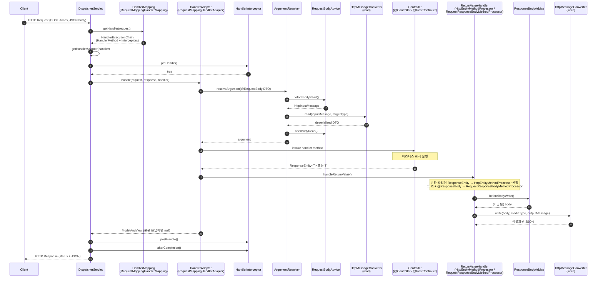

# `@Controller` 와 `@RestController` 의 차이

## 실험 배경

- `ResponseEntity<T>` 를 응답에서 사용할 때, 두 컴포넌트의 차이점이 궁금하였음.

기존에 `@Controller` 와 `@RestController` 의 차이점은
`View Resolver` 를 사용할려면 `@Controller`, JSON 같은 형태면 `@RestController`를 쓴다고 인식하였음.

그러나 이런 이유라면 `ResponseEntity`는 그냥 하나의 `Wrapper` 에 불구하다는 생각이 들어 실험을 해보고자 하였음.

## 발단 — 비대칭 상태에서도 결과가 같았던 두 컨트롤러

처음에는 두 컨트롤러의 어노테이션이 달랐는데도 응답이 똑같이 JSON 으로 잘 나왔음.

```java
// 한쪽: @Controller
@Controller
@RequestMapping("/times")
public class ReservationTimeController {

    @PostMapping
    ResponseEntity<ReservationTimeResponse> enrollTime(@RequestBody ReservationTimeRequest requestBody) {
        ReservationTime result = reservationTimeService.save(requestBody.startAt());
        ReservationTimeResponse responseBody = new ReservationTimeResponse(result.id(), result.startAt());
        return new ResponseEntity<>(responseBody, HttpStatus.CREATED);
    }
    // ...
}
```

```java
// 다른 쪽: @RestController
@RestController
@RequestMapping("/reservations")
public class ReservationController {

    @PostMapping
    ResponseEntity<ReservationResponse> addReservation(@RequestBody ReservationRequest request) {
        Reservation result = reservationService.save(request.name(), request.date(), request.timeId());
        ReservationResponse responseData = ReservationResponse.fromDomain(result);
        return new ResponseEntity<>(responseData, HttpStatus.CREATED);
    }
    // ...
}
```

`@Controller` 인데도 뷰 이름으로 해석되지 않고, JSON 본문이 그대로 직렬화되었음.

> "동일하게 `ResponseEntity` 를 반환하는데, 어노테이션이 달라도 결과가 같다. 그렇다면 무엇이 분기점인가?"

## 1단계 — 로깅 도입.

분기점을 눈으로 확인하기 위해 다음 컴포넌트들을 `roomescape.config` 패키지에 추가했음.
컴포넌트 간의 역할 분담은 다음과 같음.

- `WebConfig` — 인터셉터 등록 + 시작 시 `HttpMessageConverter` 목록 출력 (`WebMvcConfigurer`)
- `HandlerInternalsLoggingConfig` — 시작 시 `ArgumentResolver` / `ReturnValueHandler` 목록 출력 (`ApplicationRunner`)
- `DispatcherServletLoggingInterceptor` — 매 요청마다 매칭된 핸들러/어댑터 출력 (`HandlerInterceptor`)
- `RequestConverterLogger` — 요청 본문 역직렬화에 사용된 컨버터 출력 (`RequestBodyAdvice`)
- `ResponseConverterLogger` — 응답 본문 직렬화에 사용된 컨버터/반환 타입/실제 body 클래스 출력 (`ResponseBodyAdvice`)

### (a) WebConfig — 인터셉터 등록 + 컨버터 목록 출력

`DispatcherServletLoggingInterceptor` 는 빈으로 만든다고 자동 적용되지 않음. `WebMvcConfigurer#addInterceptors` 로 명시적으로 등록해야 함.
같은 설정 클래스에서 `extendMessageConverters` 를 활용해 부팅 직후 등록된 모든 `HttpMessageConverter` 를 로그로 남김.

```java

@Configuration
public class WebConfig implements WebMvcConfigurer {

    private final DispatcherServletLoggingInterceptor dispatcherServletLoggingInterceptor;

    public WebConfig(DispatcherServletLoggingInterceptor dispatcherServletLoggingInterceptor) {
        this.dispatcherServletLoggingInterceptor = dispatcherServletLoggingInterceptor;
    }

    @Override
    public void addInterceptors(InterceptorRegistry registry) {
        registry.addInterceptor(dispatcherServletLoggingInterceptor)
                .addPathPatterns("/**");
    }

    @Override
    public void extendMessageConverters(List<HttpMessageConverter<?>> converters) {
        WebMvcConfigurer.super.extendMessageConverters(converters);
        logger.info("===== 등록된 HttpMessageConverter 목록 =====");
        for (int i = 0; i < converters.size(); i++) {
            HttpMessageConverter<?> converter = converters.get(i);
            logger.info("  {}. {} -> 지원 미디어 타입: {}",
                    i + 1,
                    converter.getClass().getSimpleName(),
                    converter.getSupportedMediaTypes());
        }
    }
}
```

이 설정 덕분에 부팅 시점에 다음과 같은 로그를 볼 수 있음.

```
===== 등록된 HttpMessageConverter 목록 =====
  1. ByteArrayHttpMessageConverter -> [application/octet-stream, */*]
  2. StringHttpMessageConverter   -> [text/plain, */*]
  ...
  7. MappingJackson2HttpMessageConverter -> [application/json, application/*+json]
  8. MappingJackson2HttpMessageConverter -> [application/json, application/*+json]
  9. Jaxb2RootElementHttpMessageConverter -> [application/xml, text/xml, application/*+xml]
```

→ JSON 직렬화에 사용될 `MappingJackson2HttpMessageConverter` 가 등록되어 있다는 것을 확인할 수 있음.
이후 `ResponseConverterLogger` 가 출력하는 “선택된 컨버터” 가 정말 이 목록 중 하나라는 점이 연결됨.

### (b) 등록된 ArgumentResolver / ReturnValueHandler 목록 출력

```java

@Configuration
public class HandlerInternalsLoggingConfig {

    @Bean
    public ApplicationRunner printHandlerInternals(RequestMappingHandlerAdapter adapter) {
        return args -> {
            List<HandlerMethodArgumentResolver> resolvers = adapter.getArgumentResolvers();
            List<HandlerMethodReturnValueHandler> handlers = adapter.getReturnValueHandlers();

            log.info("===== ArgumentResolver 목록 (총 {}개) =====", resolvers.size());
            for (int i = 0; i < resolvers.size(); i++) {
                log.info("  {}. {}", i + 1, resolvers.get(i).getClass().getSimpleName());
            }
            log.info("===== ReturnValueHandler 목록 (총 {}개) =====", handlers.size());
            for (int i = 0; i < handlers.size(); i++) {
                log.info("  {}. {}", i + 1, handlers.get(i).getClass().getSimpleName());
            }
        };
    }
}
```

### (c) 디스패처 서블릿이 어떤 핸들러/어댑터를 골랐는지 추적

```java

@Component
public class DispatcherServletLoggingInterceptor implements HandlerInterceptor {

    @Override
    public boolean preHandle(HttpServletRequest request, HttpServletResponse response, Object handler) {
        log.info("{} 컨트롤러 동작 전 {} {} -> handler={}",
                LOG_TITLE, request.getMethod(), request.getRequestURI(), showHandlerInformation(handler));

        HandlerAdapter selectedHandlerAdapter = findSpringUsedAdapter(handler);
        log.info("{} 사용 예정 아답터 : {}", LOG_TITLE, selectedHandlerAdapter.getClass().getSimpleName());
        return true;
    }
    // ...
}
```

### (d) 요청 본문 역직렬화에 사용된 컨버터 추적

```java

@RestControllerAdvice
public class RequestConverterLogger implements RequestBodyAdvice {

    @Override
    public HttpInputMessage beforeBodyRead(HttpInputMessage inputMessage,
                                           MethodParameter parameter,
                                           Type targetType,
                                           Class<? extends HttpMessageConverter<?>> converterType) {
        log.info("{} 본문 읽기 직전 -> 컨버터: {}, 대상 타입: {}",
                LOG_TITLE, converterType.getSimpleName(), parameter.getParameterType().getSimpleName());
        return inputMessage;
    }
    // ...
}
```

### (e) 응답 본문 직렬화에 사용된 컨버터/반환 타입/실제 body 클래스 추적

```java

@RestControllerAdvice
public class ResponseConverterLogger implements ResponseBodyAdvice<Object> {

    @Override
    public boolean supports(MethodParameter returnType, Class<? extends HttpMessageConverter<?>> converterType) {
        return true;
    }

    @Override
    public Object beforeBodyWrite(Object body,
                                  MethodParameter returnType,
                                  MediaType selectedContentType,
                                  Class<? extends HttpMessageConverter<?>> selectedConverterType,
                                  ServerHttpRequest request,
                                  ServerHttpResponse response) {
        log.info("{} {} {} -> 선택된 컨버터: {}, 미디어 타입: {}, 반환 타입: {}, 실제 body 클래스: {}",
                LOG_TITLE,
                request.getMethod(),
                request.getURI().getPath(),
                selectedConverterType.getSimpleName(),
                selectedContentType,
                returnType.getParameterType().getSimpleName(),
                body == null ? "null" : body.getClass().getSimpleName());
        return body;
    }
}
```

## 2단계 — 로그로 흐름 확인

### (1) 등록된 `ReturnValueHandler` 중 관련 항목

```
6.  HttpEntityMethodProcessor              ← ResponseEntity / HttpEntity 전용
12. RequestResponseBodyMethodProcessor     ← @ResponseBody 가 붙은 반환값 처리
```

두 핸들러는 별개로 등록되어 있음.

### (2) `@Controller` 인 `ReservationTimeController` (`POST /times`) 의 흐름

```
컨트롤러 동작 전 POST /times -> handler=ReservationTimeController-enrollTime
사용 예정 아답터 : RequestMappingHandlerAdapter
[요청 역직렬화 추적] : 본문 읽기 직전 -> 컨버터: MappingJackson2HttpMessageConverter,
                    대상 타입: ReservationTimeRequest
[요청 역직렬화 추적] : 본문 읽기 완료 -> 변환된 객체: ReservationTimeRequest[startAt=10:00]
[응답 직렬화 추적]  : POST /times -> 선택된 컨버터: MappingJackson2HttpMessageConverter,
                    미디어 타입: application/json,
                    반환 타입: ResponseEntity, 실제 body 클래스: ReservationTimeResponse

HTTP/1.1 201
Content-Type: application/json

{ "id": 1, "startAt": "10:00" }
```

### (3) `@RestController` 인 `ReservationController` (`POST /reservations`, `GET /reservations`) 의 흐름

```
[응답 직렬화 추적] : POST /reservations -> 선택된 컨버터: MappingJackson2HttpMessageConverter,
                  미디어 타입: application/json,
                  반환 타입: ResponseEntity, 실제 body 클래스: ReservationResponse

[응답 직렬화 추적] : GET /reservations  -> 선택된 컨버터: MappingJackson2HttpMessageConverter,
                  미디어 타입: application/json,
                  반환 타입: ResponseEntity, 실제 body 클래스: ListN
```

`@Controller` 와 `@RestController` 모두 동일하게,

- `반환 타입: ResponseEntity` 로 식별되었고
- `MappingJackson2HttpMessageConverter` 로 JSON 직렬화되었음.

## Spring MVC 요청 → 응답 내부 흐름 시각화

위 로그에서 관찰한 흐름을 Spring 내부 컴포넌트 단위로 정리하면 다음과 같음.
`DispatcherServlet` 이 진입점이며, 각 단계마다 어떤 컴포넌트가 끼어드는지 한눈에 보기 위함임.



핵심 분기점은 단계 13 의 `ReturnValueHandler` 선택임.

- `ResponseEntity<T>` → `HttpEntityMethodProcessor` 가 어노테이션과 무관하게 가져감.
- 본문 DTO 반환 → `@ResponseBody` 메타데이터를 보고 `RequestResponseBodyMethodProcessor` 가 가져감.
- `@RestController` 는 클래스 레벨에 `@ResponseBody` 를 묵시적으로 부여하는 메타 어노테이션이라, 두 번째 경로의 진입을 가능하게 해 주는 단축 표기임.

## 결과 분석

- 반환 타입이 `ResponseEntity` 인 경우 `HttpEntityMethodProcessor` 가 선점함.
    - `HttpEntityMethodProcessor#supportsReturnType()` 은 반환 타입이 `HttpEntity` (혹은 그 하위 타입인 `ResponseEntity`) 인지를 보고 매칭함.
    - `@ResponseBody` 의 유무는 보지 않음.
- 반면 `RequestResponseBodyMethodProcessor` 는 `@ResponseBody` (또는 클래스 레벨 `@RestController` 가 부여한 `@ResponseBody`) 를 봄.
- 따라서,
    - **`return new ResponseEntity<>(body, status);`** → `HttpEntityMethodProcessor` 가 처리. `@Controller` 든
      `@RestController` 든 무관.
    - **`return body;` (본문만 반환)** → `RequestResponseBodyMethodProcessor` 가 처리해야 하므로 `@ResponseBody` 가 필요. 이때 비로소
      `@RestController` 가 의미를 가짐.
- 본문 직렬화 자체는 두 핸들러 모두 `HttpMessageConverter` (여기서는 `MappingJackson2HttpMessageConverter`) 에 위임하므로 결과 JSON 은 같음.

이로써 비대칭 상태였던 두 컨트롤러가 왜 같은 결과를 냈는지 설명이 됨.

## 3단계 — `@RestController` 로 통일

기능적으로는 바꿀 필요가 없었지만, 어노테이션은 결국 “이 클래스가 무엇인지”를 읽는 사람에게 알려주는 정보 전달 수단이라는 점에서 두 컨트롤러를 모두 `@RestController` 로 통일했음.

```java

@RestController                       // ← @Controller 에서 변경
@RequestMapping("/times")
public class ReservationTimeController {
    // 메서드 본문은 그대로. 응답 결과도 동일.
}
```

## 결론

- **반환 타입이 `ResponseEntity<T>` 인 한, `@Controller` 와 `@RestController` 의 응답 본문 처리 결과는 동일함.
    - `HttpEntityMethodProcessor` 가 어노테이션과 무관하게 `ResponseEntity` 를 가로채기 때문임.
- `@RestController` 의 실질적 가치는 본문을 그대로 반환하는 메서드(`return dto;`) 에서 드러남.
    - 모든 메서드에 `@ResponseBody` 를 일일이 붙이지 않게 해주는 단축 어노테이션에 가까움.
- 그럼에도 `ResponseEntity` 만 반환하는 컨트롤러를 `@RestController` 로 두는 것은 동작상의 필요가 아니라 의도(“이 컨트롤러는 뷰가 아니라 데이터를 반환함”) 전달을 위한 선택임.

### Spring Framework Reference

- Web MVC — Annotated Controller 전반 (`@Controller`, `@RestController`, `@ResponseBody` 의미)
  https://docs.spring.io/spring-framework/reference/web/webmvc/mvc-controller.html
- Web MVC — DispatcherServlet 동작 원리 (요청 진입 → 핸들러 디스패치 흐름)
  https://docs.spring.io/spring-framework/reference/web/webmvc/mvc-servlet.html
- Web MVC — HandlerMapping
  https://docs.spring.io/spring-framework/reference/web/webmvc/mvc-servlet/handlermapping.html
- Web MVC — HandlerAdapter
  https://docs.spring.io/spring-framework/reference/web/webmvc/mvc-servlet/handleradapter.html
- Web MVC — Handler Interceptors
  https://docs.spring.io/spring-framework/reference/web/webmvc/mvc-servlet/handlermapping-interceptor.html
- Web MVC — `@RequestBody`
  https://docs.spring.io/spring-framework/reference/web/webmvc/mvc-controller/ann-methods/requestbody.html
- Web MVC — `@ResponseBody`
  https://docs.spring.io/spring-framework/reference/web/webmvc/mvc-controller/ann-methods/responsebody.html
- Web MVC — `ResponseEntity`
  https://docs.spring.io/spring-framework/reference/web/webmvc/mvc-controller/ann-methods/responseentity.html
- Web MVC — Message Converters / 직렬화 협상
  https://docs.spring.io/spring-framework/reference/web/webmvc/message-converters.html

### Javadoc (구현 클래스 직접 확인용)

- `@Controller`
  https://docs.spring.io/spring-framework/docs/current/javadoc-api/org/springframework/stereotype/Controller.html
- `@RestController`
  https://docs.spring.io/spring-framework/docs/current/javadoc-api/org/springframework/web/bind/annotation/RestController.html
- `ResponseEntity`
  https://docs.spring.io/spring-framework/docs/current/javadoc-api/org/springframework/http/ResponseEntity.html
- `HttpEntityMethodProcessor`
  https://docs.spring.io/spring-framework/docs/current/javadoc-api/org/springframework/web/servlet/mvc/method/annotation/HttpEntityMethodProcessor.html
- `RequestResponseBodyMethodProcessor`
  https://docs.spring.io/spring-framework/docs/current/javadoc-api/org/springframework/web/servlet/mvc/method/annotation/RequestResponseBodyMethodProcessor.html
- `RequestMappingHandlerAdapter`
  https://docs.spring.io/spring-framework/docs/current/javadoc-api/org/springframework/web/servlet/mvc/method/annotation/RequestMappingHandlerAdapter.html
- `RequestBodyAdvice`
  https://docs.spring.io/spring-framework/docs/current/javadoc-api/org/springframework/web/servlet/mvc/method/annotation/RequestBodyAdvice.html
- `ResponseBodyAdvice`
  https://docs.spring.io/spring-framework/docs/current/javadoc-api/org/springframework/web/servlet/mvc/method/annotation/ResponseBodyAdvice.html
- `MappingJackson2HttpMessageConverter`
  https://docs.spring.io/spring-framework/docs/current/javadoc-api/org/springframework/http/converter/json/MappingJackson2HttpMessageConverter.html
