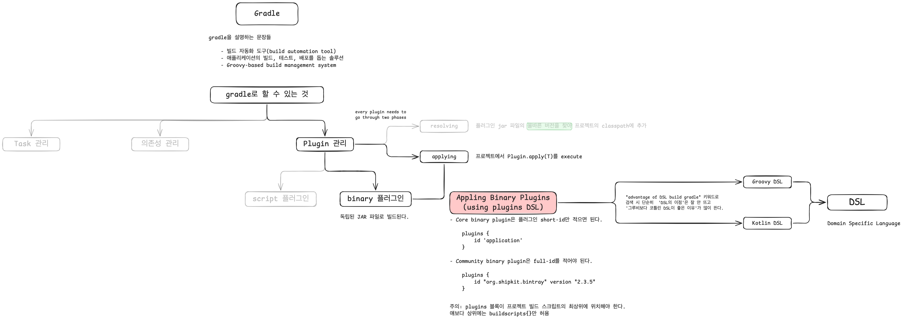

# README

## 학습법 변천 (미션 전 페어 토론)

- **v1**: 구글링을 통해 발견한 예시 코드를 미션 구현에 사용
  - 큰 고민없이 예시 코드를 그대로 사용하다 보니, 리팩터링 단위가 커지거나 예시 코드 수준을 넘어 응용이 필요한 경우 갈피를 잡지 못함

- **v2**: `리팩터링 단위가 커지거나 예시 코드 수준을 넘어 응용이 필요한 경우`에는 내가 마주한 문제를 큰 덩어리로 보지 않고, 잘게 쪼갠다. 이때 마인드맵처럼 비선형적 구조로 정리한다.

- **v3**: 단순히 '마인드맵 정리'(i 수준의 학습)에 만족하지 않고, 실험 코드를 직접 만들어보는 등의 시도(i+1 수준의 학습)를 통해 학습 내용이 장기 기억으로 전환되도록 유도한다.

### v1 (레벨 1에서의 학습법)

궁금한 주제를 영어 문장으로 구글에 검색하고, 개발 커뮤니티(Baeldung, stackoverflow)나 공식 문서의 예시 코드를 확인했다(예시: how to get sqlite connection in java).
덕분에 어느 정도 검증된 코드를 미션에 즉시 적용할 수 있었다.

하지만 예시 코드를 미션에 그대로 적용하기 어려운 경우가 많았는데, 이때 억지로 끼워맞추려는 시도를 했다. 결국 제대로 적용이 안 되는 상황으로 이어졌고, ai에게 답을 물어보게 되는 경우가 있었다.
즉, 예시 코드로부터 원리를 파악하는 깊이까지 들어가지 않고 단순히 즉시 적용하려는 시도로 인해 응용이 어려웠다.

 

### v2 (토론 후 1차 개선)

(PiFSR 중 의식적으로 연습할 한 가지 방식의 변경:
사전학습 때는 Problem-Driven이 적절하다고 생각했으나, 토론 과정에서 i+1이 더 적절하다는 결론으로 변경했다.
그 이유는 '일단 예시 코드로 미션을 푸는 것' 자체는 나선형 학습에 부합하는 것 같고,
어려움을 느끼는 지점이 '신경 쓸 부분이 많아졌을 때'이므로 그 많아진 덩어리를 쪼개고, 선택하는 연습,즉 i+1 학습법이 적절하다는 것이다.)

 

#### 학습 마인드맵 이미지

 

#### 개인 학습에서 시도한 주제

gradle이 하는 일 파악하기

 

#### v2 회고

i+1 학습법을 마인드맵 형식으로 실행하여 i 수준의 큰 주제들을 나누고, 그 중 하나를 골라 i + 1 수준까지 깊이 들어감.
사진에서는 Appling Binary Plugins using plugins DSL이 i+1 주제에 해당함.

일단 마인드맵을 통해 정리하니 단순 마크다운 문서처럼 선형적이지 않고, 비선형적으로, 키워드 중심으로 나아갈 수 있어 좋았다.
또한 여러 i 수준의 주제들을 나열해가면서 관심도가 적은 주제는 도형 및 글씨의 투명도를 30%로 설정하여 관심 밖으로 보냄으로 실제 집중할 i+1 주제만 더욱 부각되도록 했다.

애매했던 지점은 일단 전체 흐름에서의 i 주제들을 모두 분리해놓고 그 중에 i+1 주제를 선정해야 되는건지,
아니면 i 주제들을 순차적으로 찾다가, 필요한 주제가 나온 순간 그 뒤의 i 주제들은 멈추고 i+1 주제를 선정해야 되는건지 궁금하다.

현재는 플러그인 관리 주제에 집중하기 위해 그 이후 i 수준 주제인 의존성 관리는 관련 키워드 탐색도 배제한 상태다.

 

### v3 (v2로 1시간 학습 후 ai에게 코칭받아 개선)

#### v2에서 그대로 가져갈 것

현재 시점에서 집중하지 않을 i 수준의 주제들은 투명도를 30%로 설정함으로써 시각적으로 아예 배제한 시도는 뇌가 느끼는 인지적 소음을 줄이는데 효과적이다.

또한 선형적 맥락 정리(마크다운, 블로그 글 등)가 아닌, 비선형적 정리(마인드맵, 키워드맵)를 채택한 것도 계층 구조 및 주제간 연결 관계를 시각화함으로써 학습 효과를 높여 준다.

 

#### v3에서 개선할 것

'키워드 맵 정리'를 하는 것 자체로 학습을 잘 했다고 착각할 수 있다.

(이번 학습 주제를 예로 들자면) 나는 gradle의 전문가가 되기를 목표로 하는 것이 아니라, gradle을 이용해서 좋은 output을 내는 것을 목표로 해야 한다.
즉, i라는 개념에 대한 i+1을 '더 깊은 개념 학습'으로만 한정하지 않고 '실제 코드 적용을 통한 성과 개선 증명' 등 다른 방향성으로 나아가게끔 하면 추상적인 학습에서 멈추지 않고 구체적 컨텍스트를 겪음으로써 지식의 휘발성이 줄어들 것이다.
예를 들자면, binary plugin을 사용했을 때 script plugin보다 얼마나 빌드가 빠른지, 문장이 짧아지는지, 등 ...

 

### 작은 회고

1시간 미만의 짧은 시간 제한이 주어지다 보니 정말 필요한 부분에 집중하는 법(투명도 구분, 모두 파악하려 하지 않기 등)을 자연스레 채택하게 되었다.
즉, 여유로운 시간 제한 내에서의 자율적 학습보다 타이트한 시간 제한이 도움을 주었다는 것이다.

'우테코 측에서 시간 제한을 타이트하게 주는 것'을 마냥 기다리지 않고 '나만의 데드라인'들을 세부적으로 설정해두면 이번에 경험한 타이트한 시간 내에서의 본능적인 효율적 학습을 할 수 있겠다.

 

## 학습 로그 변천 (미션 진행하면서)

- [학습 로그 #1](./log-01.md)
  - 키워드 맵 기반으로 학습 주제들을 비선형적으로 연결함으로써 각 주제 간의 상호작용이 쉽도록 한다.
  - i 수준으로만 학습할 주제와 i+1 수준으로 조금 더 깊게 학습할 주제를 투명도 조절을 통해 명확히 나눈다.

- [학습 로그 #2](./log-02.md)
  - `학습 로그#1`과 동일한 전략을 사용하되, 오랫동안 풀리지 않는 문제에 관해서는 15/15 타임박싱 전략을 사용한다.

- [학습 로그 #3](./log-03.md)
  - ~~학습 테스트를 모두 마친 뒤에 미션을 시작하는 것이 아니라, 섹션 단위로 병행한다.~~
  - 기존 방법 유지

- [학습 로그 #4](./log-04.md)
  - 학습 테스트를 모두 마친 뒤에 미션을 시작하는 것이 아니라, 미션 구현을 먼저 시작하고 막힐 때만 관련 학습 테스트 섹션을 참고한다.
