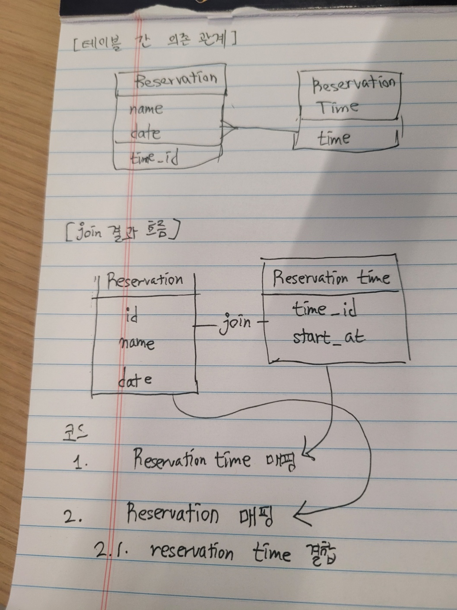

## 학습 로그 3

- **시간**: 04/29 07:30 ~ 09:52 (약 142 분)
- **학습 범위**: 3단계 시간 관리

### 1. 막힌 것의 종류

이번에 막힌 것은 어떤 종류의 어려움이었는가? (해당하는 것에 체크)

- [ ] 개념 자체를 모르겠다 (예: "스프링 빈이 뭔지 모르겠다")
- [x] 개념은 알겠는데 코드로 어떻게 쓰는지 모르겠다 (예: "JdbcTemplate 문법을 모르겠다")
- [x] 코드는 돌아가는데 이게 맞는 건지 모르겠다 (예: "계층 분리를 이렇게 해도 되나?")
- [ ] 기타: \_\_\_

### 2. 이번 타임의 학습 전략

1. 기존 AI 기반 학습 방식은 유지하되, 공식 문서 외에 입문용 글도 함께 제공받아 진입 부담을 낮췄다.
2. 포모도로(25분 focused / 5분 diffuse, 4사이클 후 긴 휴식)를 적용해 집중력 늘어짐을 막아보았다. 기록은 다음과 같다.
   1. 07:30 ~ 07:55: focused (코드 작성, 문서 읽기)
   2. 07:55 ~ 08:00: diffuse (멍 때리기)
   3. 08:00 ~ 08:25: focused (코드 작성, 문서 읽기)
   4. 08:25 ~ 08:30: diffuse (멍 때리기)
   5. 08:30 ~ **08:40**: (도중에 카페에서 우테코 건물로 이동하느라 포모도로 사이클이 깨짐)
   6. 08:40 ~ 09:20: 도착
   7. ...
3. Solo Recall Note 작성 후, 추가로 5분 동안 학습 내용을 종이에 손으로 그려보며 구조를 공간적으로 떠올렸다 (디지털 도구 금지).
   - 결과물: 테이블 간 의존 관계와 join 결과 매핑 흐름
   - 

### 3. 전략 평가

- 포모도로는 제대로 실천하지 못했다. 7시 반에 시작했는데 우테코 건물까지 가는 시간 때문에 카페에 있다가 사이클 도중에 이동을 해야했다. 그렇기에 4단계에서 다시 정석으로 포모도로를 적용해보려고 한다.
- 이번 경우에는 공식 문서가 도움이 되었던 사례가 있었다. `queryForObject()`, `query()`를 사용할 때 오버로딩된 메서드가 많아서 어떤 걸 써야할지 몰랐는데, 공식 문서에 각 파라미터에 대한 설명이 있어서 도움이 되었다. 하지만 공식 문서가 항상 친절한 설명을 담고 있는 것은 아니므로, 입문용 글도 함께 제공하는 전략은 유지할 것이다.
- solo recall note는 다음 레벨을 시작하기 전에 어떤 걸 이번 단계에서 개선하려 하는지 가이드라인이 되었다고 생각한다.

### 4. AI 피드백

앤더스 에릭슨 역할로 피드백을 받았다.

#### 4.1. pre-mortem

설계 판단이 지금과 다른 점은. 틀려도 코드는 돌아간다는 것이다. 그래서 나의 학습 로그에서 "코드는 돌아가는데 맞는 건지 모르겠다"가 떠오르는 것이다. 결정의 옳고 그름은 나중에 다른 결정과 부딪힐 때만 드러나는데, pre-mortem은 그 충돌을 사전에 시뮬레이션시킨다.

```text
[Pre-mortem 설계 일지 운영 룰]

위치: docs/study-log/premortem-NN.md (recall과 별도)
빈도: 4단계. 의사결정이 필요할 때마다
분량: A4 1장 / 마크다운 30줄 이내
시간: 15분 상한 (타이머 켜라)
독자: 1주일 후의 너 (PR 머지 후 다시 읽음)

작성 형식 — 결정 5개 이내, 각 결정마다:

  결정 #N: ___을 ___ 위치에 두기로 했다

  대안: (버린 형태 1개만)

  채택 이유: 1~2줄

  내가 틀렸다면 나타날 증상:
    - "이런 코드 변경이 ___에 파급된다"
    - "이런 테스트가 갑자기 어려워진다"
    - "이런 의존이 *역방향*으로 생긴다"

  (증상 1~2개. 더 쓰지 말 것)
```

### 5. 다음 타임에 바꿀 것

- 포모도로는 유지한다. 일정상 제대로 적용하기 어려웠다고 느껴져 이번에 다시 해보기로 했다.
- 공식 문서만 가져오는 방향 수정이 필요하다. 4단계는 구조 설계 방법의 얘기를 하는데, 공식 문서에는 사용법이 있지 구조 의사결정 방법을 제공하지 않는다. 입문용 글도 함께 제공하는 전략은 유지한다.
- 이번에 pre-mortem을 도입해보기로 했다. 4단계는 설계 방법에 대한 얘기를 하는데, premortem이 설계 결정의 옳고 그름을 사전에 시뮬레이션해보는 도구이므로, 4단계에서 도입하기에 적절하다고 생각하였다.
